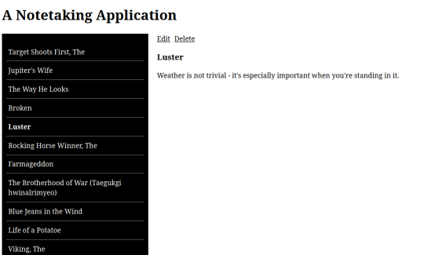
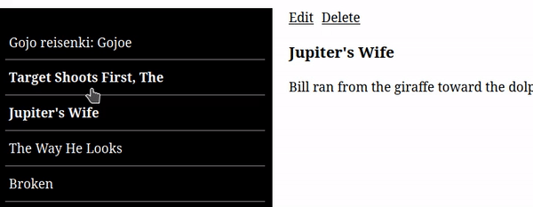

# React Note Taking Application

In this project you will be building a notetaking application, similar to existing tools such as [Joplin](https://joplinapp.org/), [Obsidian](https://obsidian.md/)

## What you will be doing

This project assumes you've already had experience with:

- React Basics
- create-react-app
- React Components
- Handling state in React
- Handling styles in React

You may also wish to use:

- React Context API

## Expectations

✔ Create your own design

✔ Separate your code into components

✔ You can use functional or class based components, or both

## Requirements

Your note taking application should have the following functionality:

✔ View notes as a summarised list

✔ Select notes and view the title and body

✔ Add notes

✔ Delete notes

✔ Edit notes

## Tasks

Create a new project folder, using `create-react-app`

Use a folder name of your choice

[How to use create-react-app](https://reactjs.org/docs/create-a-new-react-app.html#create-react-app)

## Task 1 - Think before you write

We all want to start write code straight away. Take some time to think about the code you will write, before you write it.

What is it you want to do?

1. How would you break this design into smaller parts?

2. What React components could you create?

3. Can any of those components be re-used?

4. How many components will you need?

## Task 2 - Start small

Build 1 component inside `App.js`

`<NoteList />`

- This should list all the `titles` of the notes

- Use the provided `data.json` as your source of data (or [create your own](https://www.mockaroo.com/)).

> Hint: You may wish to pass in the data as a prop

## Task 3 - Our next component

Create another component,

`<NoteView />`

This component will show the title and the body of the selected note.

For now it will be empty, since we have not added the selection functionality

## Task 4 - Selecting a note

Use the `onClick` event to listen for individual clicks on each child of the `<NoteList />` component.

Update the view of the `<NoteView />` component to display the `title`, the `time` and the `body` of the selected note. 

> Hint: You will need to use state or Context API to manage state across components

## Task 5 - Add some styles

Style your components using one of the methods you're familiar with, for example you could use either:

- CSS
- CSS + CSS Modules
- SCSS

## Task 6 - Adding and deleting notes

Add functionality to add / delete notes in the main `<NoteList />` component

> Hint: How will you handle deleting an actively selected note?

## Task 7 - Editing notes

Add functionality to edit currently selected notes in the main `<NoteView />` component.

You may wish to use:

- A modal
- A `<textarea>` HTML element

> Hint: You can render different JSX depending on the activity in the component. For example, you can have one rendering for when the text is not being edited, and another for when it is being edited

## Task 8 - Context API

If you have not done so, try refactoring your code to use Context API

## Preview

---

